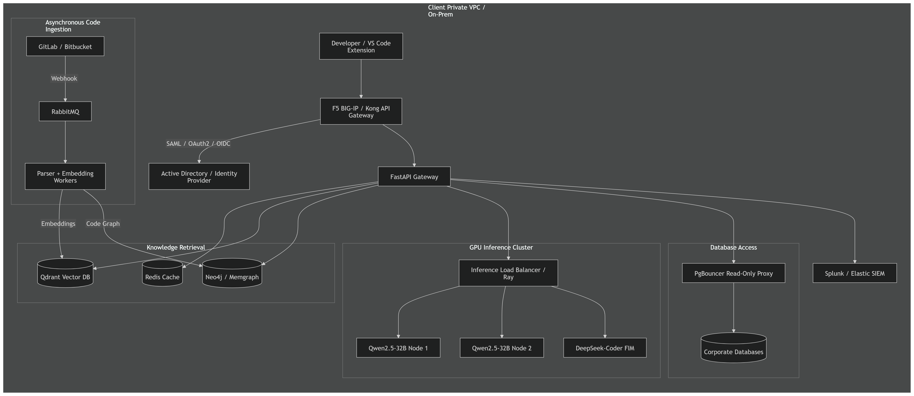

# Enterprise Architecture & Deployment Design: Project M5 for Tier-1 Financial Institution

This document provides a secure, scalable, and resilient systems design for deploying Project M5 to a tier-1 investment bank (e.g., JP Morgan Chase) featuring thousands of concurrent engineers, millions of lines of code (LOC), and zero-egress compliance environments.

---

## 1. Physical Deployment Topology

### The Technical Design

To align with strict security and IP protection policies (such as SOC2, GDPR, and Dodd-Frank requirements), the entire system is deployed inside the client's **Private VPC** (AWS GovCloud / Azure Dedicated) or **On-Premise Private Cloud** (managed via Red Hat OpenShift / Kubernetes).

### 💡 Layman's Analogy (The Bank Vault)

> Think of this deployment like building a **library inside a bank vault**. Instead of placing our AI on the public internet where anyone can access it and code might leak out, we build it entirely inside JPMC's physical building. The **API Gateway** acts as the security guard at the vault door, checking ID cards (**Active Directory/SAML**) before letting anyone in.

### 🔑 Key Terms for Freshers

- **VPC (Virtual Private Cloud):** A private, isolated section of a cloud provider (like AWS) reserved exclusively for JPMC. No outside internet traffic can get in directly.
- **API Gateway:** The single entry point for all client requests. It manages security, limits traffic spikes, and forwards requests to the correct internal service.
- **Kubernetes / OpenShift:** Software that automates deploying, scaling, and managing containerized applications (like our backend APIs) so they don't crash.

---

## 2. Ingestion & Storage Scaling (Millions of Lines of Code)

### The Technical Design

Standard startup RAG code engines parse repositories on demand. For millions of LOC across thousands of active repositories, this is too slow and resource-intensive. We implement an asynchronous, event-driven parser.

1. **Trigger:** Developers push code to GitLab Enterprise or Bitbucket Server. A webhook is fired.
2. **Queueing:** Webhooks load a task broker (RabbitMQ/Apache Kafka).
3. **Execution:** AST Parser workers pull the repository diff, parse modified files using Tree-Sitter, and extract semantic chunks.
4. **Embeddings:** A pool of dedicated, lightweight GPU workers (using Triton Inference Server serving `nomic-embed-text` or `bge-m3`) embeds only the modified code chunks.
5. **Consolidation:** The updated embeddings are upserted into the vector database, and the import/class relationships are modified in the graph database.

To scale vector lookups inside **Qdrant**:

- **Horizontal Partitioning (Sharding):** Collections are partitioned across multiple Qdrant nodes based on `repository_id`. This isolates search scopes to the specific code repositories the developer is working on.
- **Quantization:** Standard float32 vectors are compressed using Scalar Quantization (INT8) or Product Quantization (PQ) to reduce VRAM requirements by up to 4x while maintaining $&gt;98%$ search accuracy.
- **HNSW Optimization:** The search index is optimized for high read throughput using custom payload indexes on `repository_id` and `file_path`.

### 💡 Layman's Analogy (The Smart Book Indexer)

> Imagine a massive library with millions of books. If a writer edits page 42 of a book, a traditional system would re-read the entire book from scratch to update the index. Our system uses a **Webhook (Notification)** that tells a **Broker (Mail Sorter)** to send only that single page edit to an **AST Parser (a smart analyzer)**. It extracts just the new paragraphs, converts them into numeric meaning summaries (**Embeddings**), and files them in a **Vector DB (a filing cabinet sorted by topics)**. **Sharding** means we keep different projects in separate drawers, so we don't search the whole library when we only need the trading desk code.

### 🔑 Key Terms for Freshers

- **Webhook:** An automated message sent by an application (like GitLab) when something happens (like pushing new code) to trigger another service.
- **Vector Database (Qdrant):** A database built to store and search "vectors" (mathematical arrays representing the semantic meaning of text or code) so we can search by *concept* rather than just *keywords*.
- **Sharding:** Splitting a large database database table horizontally across multiple machines to balance the load.

---

## 3. High-Concurrency Inference Layer (Thousands of Engineers)

### The Technical Design

Running inference via Ollama is single-threaded and lacks multi-tenant optimizations. For an enterprise-scale load, we replace Ollama with **vLLM (Virtual Large Language Model)** orchestrating a **Ray cluster**.

| Metric | Prototyping (Ollama) | Enterprise Scale (vLLM / Triton) |
| --- | --- | --- |
| **Serving Architecture** | Single instance | Distributed Ray cluster with load balancing |
| **Memory Management** | Native CUDA allocators | **PagedAttention** (eliminates KV cache memory fragmentation) |
| **Batching** | Sequential / static | **Continuous Batching** (batches requests at the iteration level) |
| **Scalability** | Single GPU bottleneck | Tensor Parallelism (TP) / Pipeline Parallelism (PP) |
| **Autocompletion Latency** | 200ms - 1s | **$&lt;150\\text{ms}$** (via Speculative Decoding) |

### Scalability Calculations & Sizing (Example: 2,000 Active Developers)

- **Active Users:** 2,000 developers.
- **Concurrent Requests:** Assuming 10% active concurrent request generation (200 requests/sec, dominated by inline autocomplete triggers).
- **VRAM Calculations (Qwen 2.5 Coder 32B Quantized to AWQ 4-bit):**
  - Model Weight Memory: $\\approx 18\\text{ GB}$ VRAM.
  - KV Cache per User (8k context): $\\approx 4\\text{ GB}$ VRAM.
  - Total VRAM per Instance: $\\approx 24\\text{ GB}$ (fitting on a single NVIDIA A10G/L4 GPU).
- **GPU Cluster Recommendation:** Deploy 8x Node clusters, each running 4x NVIDIA L4 GPUs (32 GPUs total) managed by Kubernetes horizontal pod autoscalers (KPA) scaling on queue depth.

### 💡 Layman's Analogy (The Fast-Food Kitchen)

> If you have a single chef (Ollama) in a kitchen, they make one hamburger for one customer at a time while others wait. If 2,000 hungry customers arrive, the kitchen collapses. **vLLM** acts like a highly optimized McDonald's kitchen:
>
> 1. **Continuous Batching:** The chefs start cooking patties immediately for new orders while buns are warming up for older ones, rather than waiting for each order to finish completely.
> 2. **PagedAttention:** Instead of reserving a huge dining table for every single customer (which wastes space if they are alone), we allocate seats dynamically so no VRAM is wasted.

### 🔑 Key Terms for Freshers

- **Inference:** The process of running data through a trained machine learning model to generate a prediction or response (e.g., asking the AI to write a function).
- **KV Cache:** A memory pool where the model stores past tokens from a conversation so it doesn't have to re-read the entire chat history for every new word it generates.
- **Tensor Parallelism (TP):** Splitting a single model's mathematical layers across multiple GPUs because it is too large to fit in the VRAM of a single card.

---

## 4. Financial-Grade Security & Compliance (RBAC + Auditing)

### The Technical Design

In a bank, developers are restricted from seeing specific repositories (e.g., Algorithmic Trading code, M&A database). We enforce access control at every layer.

- **Document-Level Security (DLS) in Vector Retrieval**:When a user queries the model from VS Code, the extension sends their JWT token (signed by corporate Okta/Active Directory). The FastAPI Gateway decodes the JWT and fetches the user's authorized repository list. In Qdrant, we apply a **Metadata Filter** on the vector search query:

  ```json
  {
      "filter": {
          "must": [
              { "key": "repository_id", "match": { "any": ["repo_123", "repo_456"] } }
          ]
       }
  }
  ```
- **Read-Only DB Proxy & Execution Guardrails**:Text-to-SQL is routed through a proxy layer. The backend connects to databases via PostgreSQL roles that have `SELECT` privileges only on non-sensitive tables. **NeMo Guardrails** block queries containing regulatory-sensitive tables (e.g., `client_credit_scores`). Automatic timeouts (`statement_timeout = 2000`) prevent runaway joins from freezing the database.
- **Full Auditability**:Every prompt, retrieved code chunk, generated SQL query, and response is logged to an immutable enterprise log engine (such as Splunk) with user IDs and compliance hash tags.

### 💡 Layman's Analogy (The Keycard & Security Officer)

> Imagine a research facility. You cannot walk into a room unless your **Keycard (JWT/RBAC)** lets you in. When you ask the AI a question, it check your keycard. If you don't work in the Investment Trading department, the AI **filters out** those codebooks so you can't even search them. When you ask the AI to query database records, a **Security Officer (Guardrails)** stands next to the database. If the AI tries to write a command like `DELETE` or access `Social Security Numbers`, the officer grabs the query and shreds it immediately.

### 🔑 Key Terms for Freshers

- **RBAC (Role-Based Access Control):** A method of restricting system access to authorized users based on their job roles (e.g., Intern vs. VP).
- **JWT (JSON Web Token):** A secure, digital ID card that proves who you are and what access rights you have when communicating with servers.
- **SQL Injection / Prompt Injection:** Hacking techniques where malicious inputs are fed to LLMs or databases to trick them into leaking data or running destructive commands.

---

## 5. Performance Optimization Techniques

### The Technical Design

1. **Semantic Cache (Redis):** If an engineer asks a recurring question ("How do I initialize the internal JPMC logging library?"), the request is intercepted by a semantic Redis cache that maps prompt similarity using embeddings. If a close match is found ($&gt;0.95$ cosine similarity), the cached answer is returned immediately, bypassing LLM inference entirely.
2. **Speculative Decoding for Autocomplete:** Auto-completions are latency-sensitive ($&lt;150\\text{ms}$). We pair the primary 32B Coder model with a tiny draft model (e.g., Qwen 2.5 Coder 1.5B) to generate draft tokens rapidly. The primary model verifies them in parallel, reducing latency by up to 2.5x.
3. **Local Context Pinning:** The VS Code extension caches the AST representation of the currently active files locally inside the developer's client RAM, avoiding round-trips to the vector database for local edit-in-progress modifications.

### 💡 Layman's Analogy (The Cheat Sheet & Junior Assistant)

> If you are taking a test, walking to the library to look up every formula takes too long.
>
> 1. **Local Context Pinning:** Keeping a small **cheat sheet** of formulas in your pocket (storing local file code inside active VS Code extension memory) so you can read it instantly.
> 2. **Semantic Cache:** If you get a question you've already answered before, you copy-paste the old answer instead of re-solving it.
> 3. **Speculative Decoding:** A fast-writing **junior assistant (1.5B model)** writes draft answers quickly on a notepad. The **senior expert (32B model)** glances over the draft, nods at the correct words, and corrects any mistakes. This is much faster than the senior expert writing every word from scratch.

### 🔑 Key Terms for Freshers

- **Latency:** The delay or time taken between making a request and receiving a response. High latency means lag; low latency means fast responses.
- **Semantic Cache:** Storing previous answers in memory and returning them if a new question asks the same concept (even if written with slightly different words).
- **Speculative Decoding:** An acceleration technique where a small, fast model guesses what the large model will output, and the large model validates the guesses in parallel.

---

## 6. JPMC CTO Presentation Cheat Sheet (Q&A Strategy)

When pitching this system to a CTO or a Head of Infrastructure, they will try to test your architectural depth with high-impact questions. Here are the exact questions they will ask, along with your layperson and technical answers.

### ❓ Question 1: "Why can't we just use OpenAI or Anthropic APIs with private keys? We can sign a Business Associate Agreement (BAA) with them."
*   **Layman Response:** *"Even with a contract, our code and client data would still leave JPMC servers and travel across the public internet. For JPMC, our proprietary code is our gold. If any trade secrets or customer account profiles leak, the financial and regulatory fines would be catastrophic. Our system keeps 100% of the data inside our own vault."*
*   **Technical Response:** *"JPMC operates under strict Zero-Telemetry and data sovereignty constraints (e.g., GDPR, SOC2 Type II, and SEC rules). Any API-based cloud solution, even over private endpoints, introduces data transit risks and lacks offline compliance capability. By running a local serving stack (vLLM) inside our own private VPC/On-Prem OpenShift cluster, we ensure complete air-gapped data isolation and zero external egress."*

### ❓ Question 2: "Our developers will complain about lag. Autocomplete has to be instantaneous. How are you matching GitHub Copilot’s speed?"
*   **Layman Response:** *"We use three shortcuts to make it super fast: first, we check a list of common code answers before asking the main brain; second, we keep a mini cheat sheet of the active file in the developer's VS Code window; and third, we use a fast junior writer to draft suggestions while the senior expert checks them in the background."*
*   **Technical Response:** *"We target a sub-150ms latency SLA for inline completions. We achieve this through: 1) **Redis Semantic Caching** to intercept redundant prompts, 2) **Local Context Pinning** in the extension's memory to avoid round-trips to the vector DB, and 3) **Speculative Decoding** where a lightweight draft model (Qwen 1.5B) handles token prediction in lockstep with our primary 32B model validating inputs."*

### ❓ Question 3: "How do you guarantee that a junior developer doesn't use the AI to search or read proprietary algorithmic trading code they don't have access to?"
*   **Layman Response:** *"The AI checks the developer's JPMC security badge every single time they ask a question. If their badge doesn't grant access to the trading desk files, the search engine hides those files entirely. The AI can't read what it can't see."*
*   **Technical Response:** *"We enforce **Document-Level Security (DLS)** at the vector database retrieval layer. When a query is initiated, the developer's signed OIDC JWT token is parsed by our FastAPI backend. The backend maps user roles to repository permissions and attaches a strict **Metadata Filter** to the Qdrant query. The search space is filtered at the database engine level, preventing unauthorized context retrieval or model hallucinations of restricted code bases."*

### ❓ Question 4: "Executing SQL generated by an AI model is extremely dangerous. What if the model hallucinated a DELETE or DROP command and wipes a database?"
*   **Layman Response:** *"First, the AI is connected to the database with a 'read-only' account—it physically doesn't have the keys to write or delete anything. Second, we have a security officer system checking the commands before they run, and if it sees any delete words, it stops it. Finally, if a search runs too long, we unplug it automatically."*
*   **Technical Response:** *"We implement a defense-in-depth safety architecture: 1) **DB-Level Sandboxing:** Connections are routed through dedicated read-only proxy pools with select-only privileges. 2) **Query Sanitation Guardrails:** NeMo Guardrails intercept the generated SQL, running AST/regex checks to block forbidden statements (`DELETE`, `DROP`, `ALTER`). 3) **Runtime Constraints:** We enforce strict query timeout limits (`statement_timeout = 2000`) to mitigate resource exhaustion from unoptimized joins."*