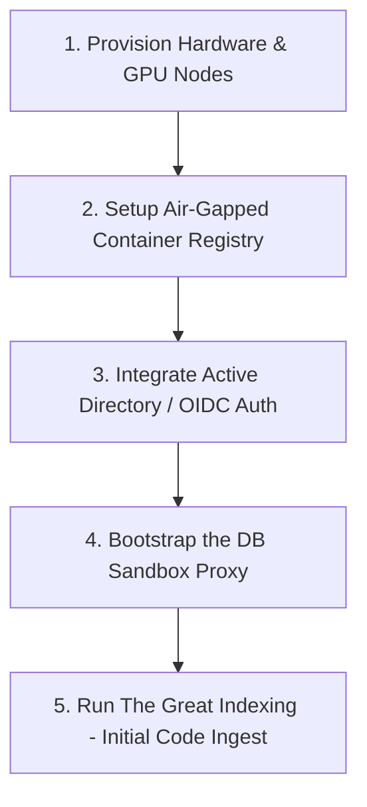
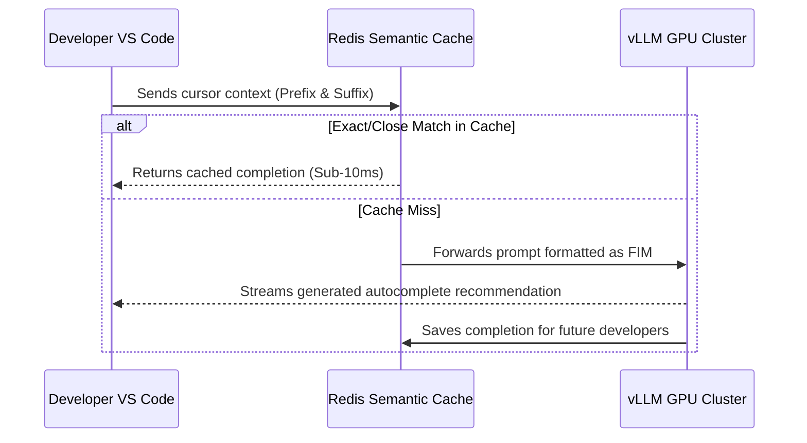
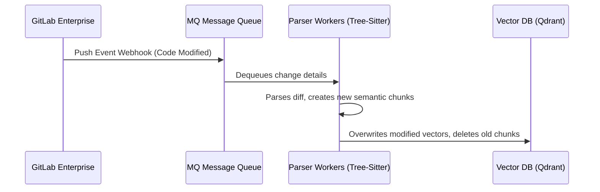
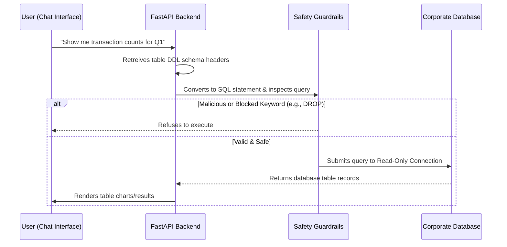

# Enterprise Setup & Workflow Manual: Project M5

This document details the step-by-step procedures for the **Initial Setup (Day 0 Bootstrapping)** and **Ongoing Routine Workflows (Day 1+ Operations)** of Project M5 within a high-security enterprise environment (e.g., JPMC).

---

## 1. Initial Setup Flow (Day 0: Bootstrapping the System)
Before any developer can use the system, the platform team must configure the environment, establish network access, and build the initial codebase indexes.

### Step 1.1: Hardware & Infrastructure Provisioning
*   **The Tech Work:** Deploy GPU-enabled Linux servers (typically running NVIDIA A100 or L4 GPUs) inside JPMC’s internal Kubernetes or OpenShift cluster. Attach fast SSD storage volumes (such as AWS EBS gp3) for vector database storage.
*   **💡 Layman's Terms:** We need to rent or buy computer servers with high-powered graphics cards (GPUs) inside the bank's secure private network and attach fast storage drives to hold our data.

### Step 1.2: Establish the Air-Gapped Registry
*   **The Tech Work:** Because JPMC servers cannot connect to public websites (like Docker Hub, GitHub, or Hugging Face), we download all Docker container images (`vllm`, `qdrant`, `fastapi-backend`) and model weights (`Qwen 2.5 Coder 32B`, `sentence-transformers`) onto a secure offline transfer drive (or transfer them via an internal staging proxy). We upload them to JPMC’s internal container registry (e.g., JFrog Artifactory).
*   **💡 Layman's Terms:** JPMC servers are completely unplugged from the internet. We cannot run `pip install` or `docker pull` on the live servers. Instead, we download all the files onto a secure, screened drive, check them for viruses, and import them into JPMC's internal app store.

### Step 1.3: Configure Single-Sign-On (SSO) Authentication
*   **The Tech Work:** Register Project M5 as a client application in JPMC’s Okta or Active Directory Identity Provider. Set up OAuth2/OIDC protocols so that the FastAPI backend can validate developer identities.
*   **💡 Layman's Terms:** Connect the app to the bank's employee database. When a developer logs in, they use their standard JPMC username and password, which gives them a secure digital entry token.

### Step 1.4: Target Database Sandbox Connection
*   **The Tech Work:** Create a read-only database user profile inside the target corporate databases. Route connections through an internal proxy (like PgBouncer) and enforce command timeouts and NeMo Guardrail policy configurations.
*   **💡 Layman's Terms:** Make a special user account on the bank's database that can only *read* tables but is forbidden from modifying or deleting anything. We also put a speed limit on queries so nobody runs a command that freezes the system.

### Step 1.5: "The Great Indexing" (First-time Code Load)
*   **The Tech Work:** Run a batch job that connects to JPMC’s internal Git server. Retrieve the latest source code from all authorized code repositories, parse it using Tree-Sitter, convert the code blocks to vector embeddings, and save them in the Qdrant database.
*   **💡 Layman's Terms:** The first time we set this up, the AI knows nothing about the bank's code. We run a giant batch program that reads all the bank's existing software files, analyzes how they work, and indexes them in our Vector Database file cabinet so the AI can search through them.

---

## 2. Ongoing Operational Workflow (Day 1+: How it Works Daily)
Once bootstrapped, the system runs automatically. Here is the lifecycle of how a developer interacts with it on a daily basis.

### Workflow A: The Inline Code Completion Loop (Every 5 seconds)
Whenever a developer writes code inside VS Code, completions are served automatically in less than 150 milliseconds:

1.  **FIM Prompting:** The VS Code extension reads the code *before* the cursor and the code *after* the cursor.
2.  **Fast Cache Check:** The request is sent to the Redis Semantic Cache. If another developer recently wrote identical code, the response is returned in under 10ms.
3.  **Speculative Inference:** If not cached, the request goes to the `vLLM` GPU cluster, where a fast 1.5B model drafts the completion, and a 32B model verifies it in parallel, returning the output to the user's IDE.

---

### Workflow B: The Auto-Indexing Loop (Every Commit)
To keep the AI up-to-date with code changes:

1.  **Code Commit:** A developer merges a branch in GitLab.
2.  **Webhook Trigger:** GitLab sends a webhook to the queue broker (**RabbitMQ**).
3.  **Incremental Parsing:** Parser workers pull the changes, run **Tree-Sitter** on the modified files, generate vectors for new/modified functions, and update the vector database without affecting unchanged files.

---

### Workflow C: The Database Text-to-SQL Loop
When a developer or business analyst asks a database question in natural language:

1.  **Prompt:** User asks: *"How many new credit card users registered last week?"*
2.  **Context Construction:** The backend pulls the relevant table schema layouts (tables, columns) and asks the LLM to write a SQL query.
3.  **Sanitation Guard:** The generated SQL is scanned by the **Guardrails** filter. Any queries containing write commands (`DELETE`, `UPDATE`, `DROP`) or referencing sensitive unauthorized columns are blocked.
4.  **Sandbox Execution:** The safe query runs on a read-only database connection with a strict timeout limit. The results are returned to the user in a formatted table.

---

## 3. Maintenance & Monitoring Workflow (Operations Team)

*   **Model Upgrades:** When a better open-source coding model is released (e.g., Qwen 3), the DevOps team downloads the weights, checks them inside a sandbox, and switches the `vllm` model path variables. The IDE extensions don't need any updates.
*   **Vector DB Maintenance:** Every month, a cron job executes index optimization on Qdrant, compressing memory blocks and cleaning up orphans.
*   **Splunk Auditing:** Compliance officers inspect Splunk logs weekly to monitor queries and search actions, checking for pattern irregularities or attempted policy bypasses.
