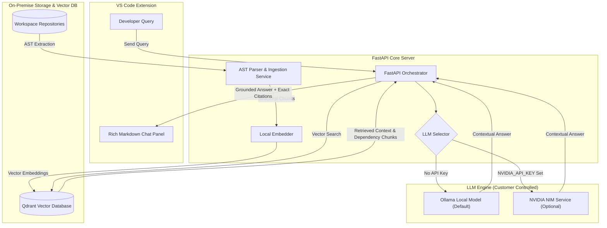

# M5 — On-Premise AI Code Intelligence

> **Evidence-first, customer-controlled repository understanding for security-conscious engineering teams.**

M5 helps engineering organizations analyze, onboard, and investigate legacy or sensitive codebases without sending source code or prompts to external AI providers. All answers are grounded in exact repository snapshots with verifiable file paths and line-range citations.

---

## 🏗️ Architecture & System Flow



---

## ✨ Key Features

- 🔒 **Customer-Controlled & Air-Gapped Ready**: Operates on local models (Ollama) or internal infrastructure with zero external telemetry.
- 📌 **Exact Evidence & Citations**: Every substantive answer includes repository file paths and exact line ranges.
- 🌳 **Graph-RAG & AST Structural Context**: Ingests codebases using Tree-sitter/AST parsing and expands graph dependencies for neighboring code context.
- 🎨 **Rich IDE Experience**: VS Code Extension webview with rich GitHub-Flavored Markdown (headers, bolding, italics, bullet lists, code blocks with copy buttons, and citation pills).
- 🔄 **Automatic Model Fallback**: Uses local Ollama (`qwen2.5-coder`) by default; seamlessly switches to NVIDIA NIM when an API key is configured.

---

## ⚙️ Environment Configuration

Set environment variables in your root `.env` or system environment:

| Variable | Default | Description |
| --- | --- | --- |
| `M5_OLLAMA_BASE_URL` | `http://localhost:11434` | Ollama model service URL |
| `M5_OLLAMA_MODEL` | `qwen2.5-coder:1.5b` | Local Ollama model name |
| `M5_QDRANT_HOST` | `localhost` | Qdrant vector database hostname |
| `M5_QDRANT_PORT` | `6333` | Qdrant vector database port |
| `M5_WORKSPACE_ROOT` | Current Directory | Root workspace path to index |
| `NVIDIA_API_KEY` | *(empty)* | Optional NVIDIA NIM API Key (Unset falls back to Ollama) |
| `NVIDIA_MODEL` | `nvidia/nemotron-3-ultra-550b-a55b` | Model name when `NVIDIA_API_KEY` is active |

---

## 🚀 Quick Start

### 1. Run Backend Stack with Docker Compose

```powershell
docker compose --env-file .env -f docker/docker-compose.m5.yml up -d
```

### 2. Run FastAPI Backend Locally

```powershell
cd backend
python -m uvicorn app.main:app --host 127.0.0.1 --port 18000
```

### 3. Run Automated Tests

```powershell
python -m pytest backend/tests/test_api_endpoints.py
```

### 4. Build & Install VS Code Extension

```powershell
cd extension
npm run compile
npx @vscode/vsce package
```

Install `M5-0.0.1.vsix` via VS Code (`Ctrl+Shift+X` -> `...` -> **Install from VSIX...**) and run **Developer: Reload Window**.
